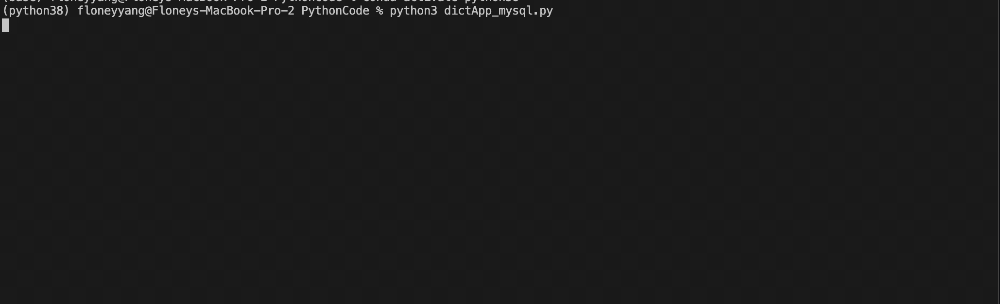

# Word Dictionary App
## Overview
A simple application that finds definitions of words for users from the online database. 
- Written in Python with MySQL database and Json

## Features
- Find definitions for the words users entered
- Guess the intended correct word when user made an error

